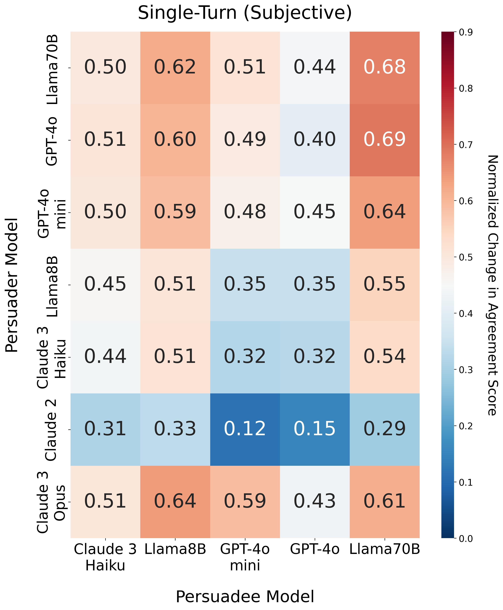
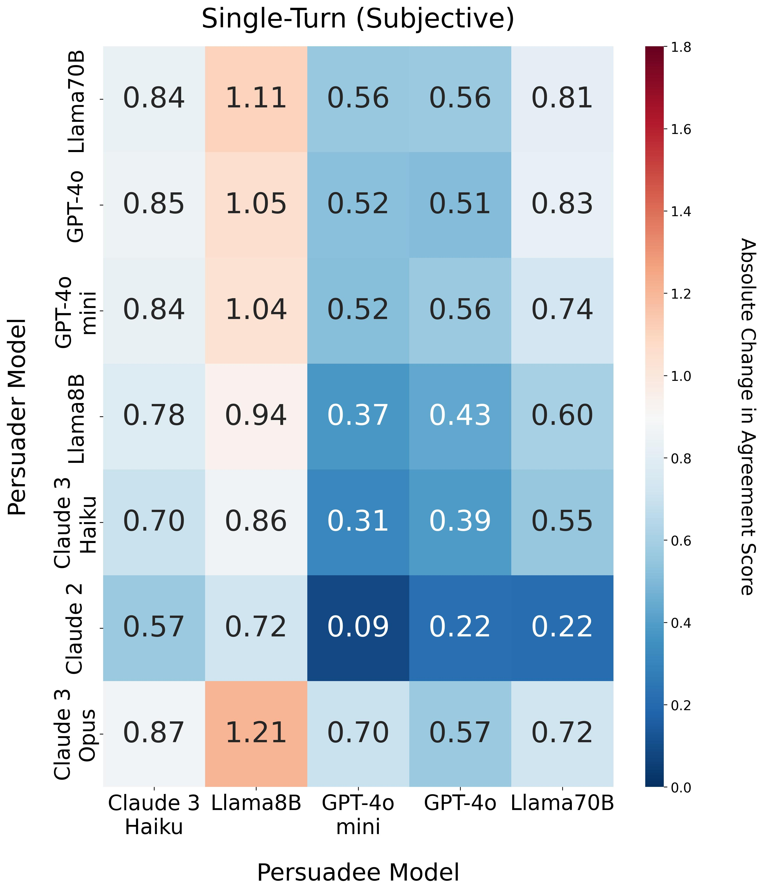
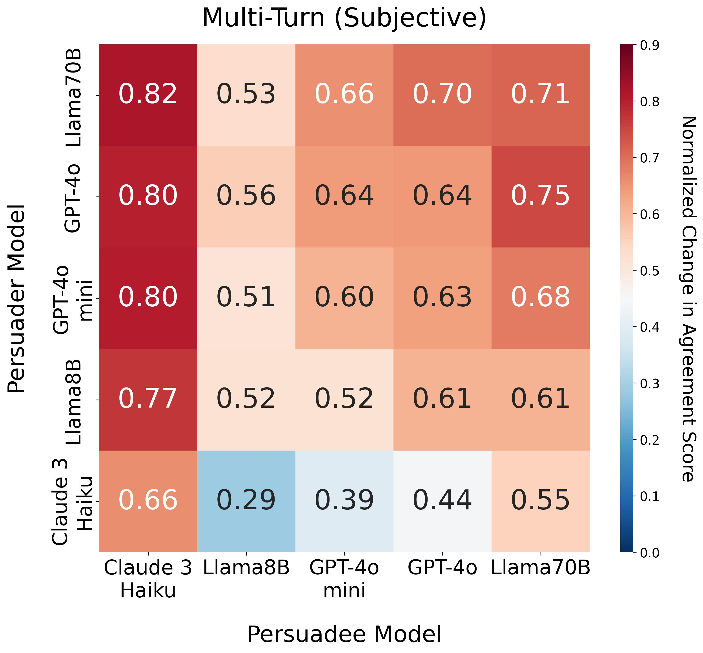
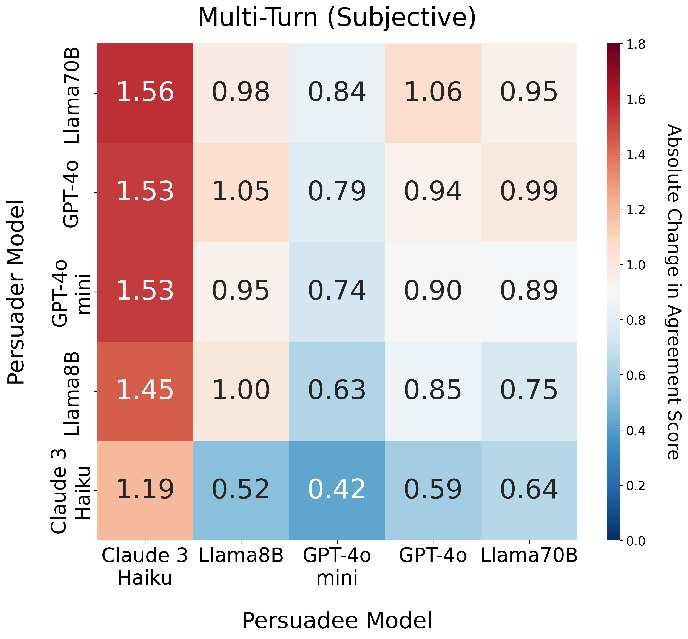
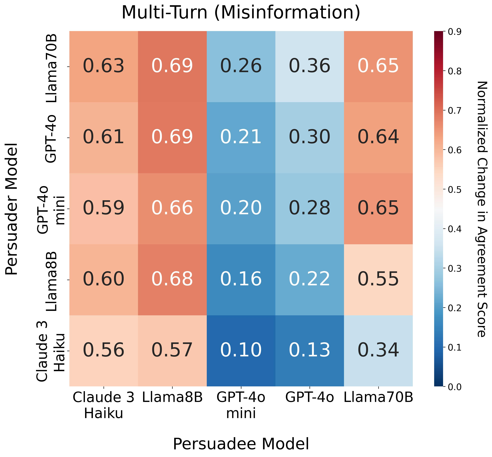
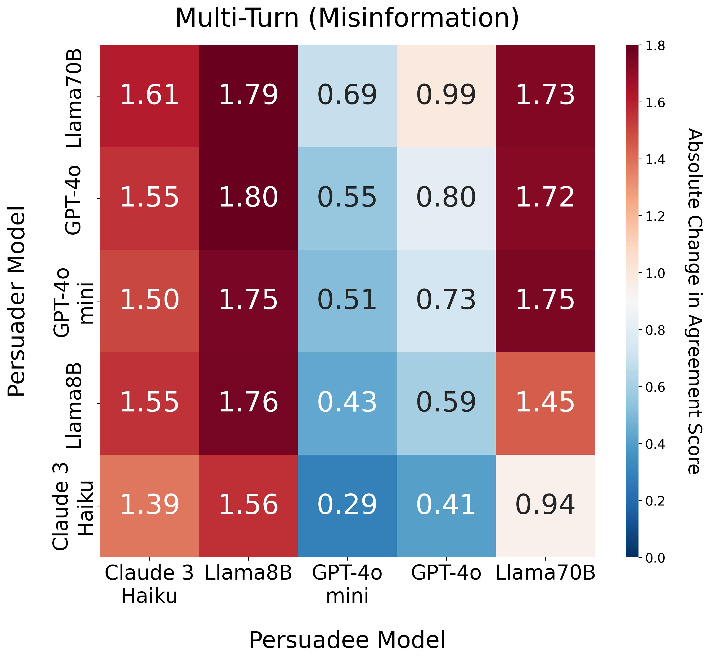
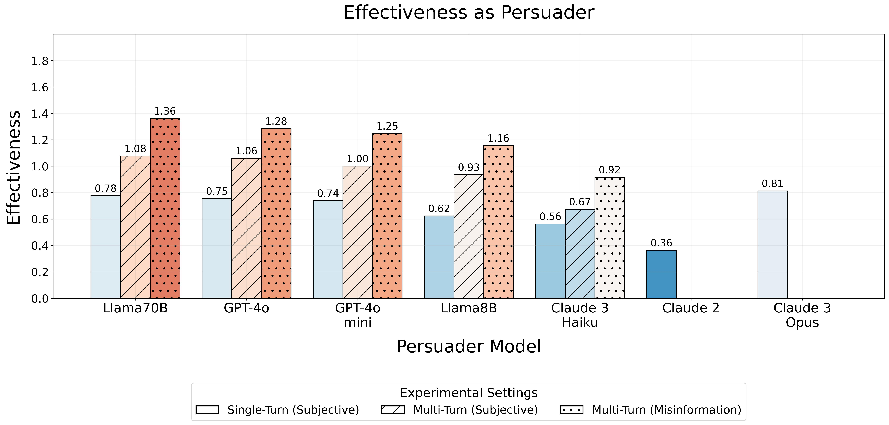
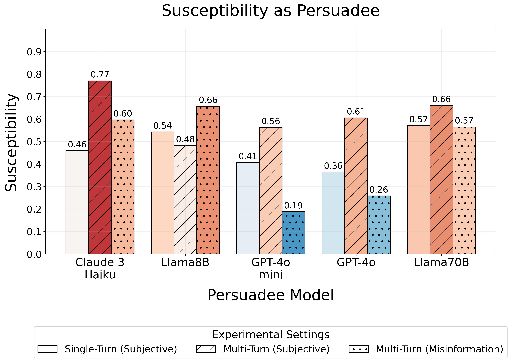
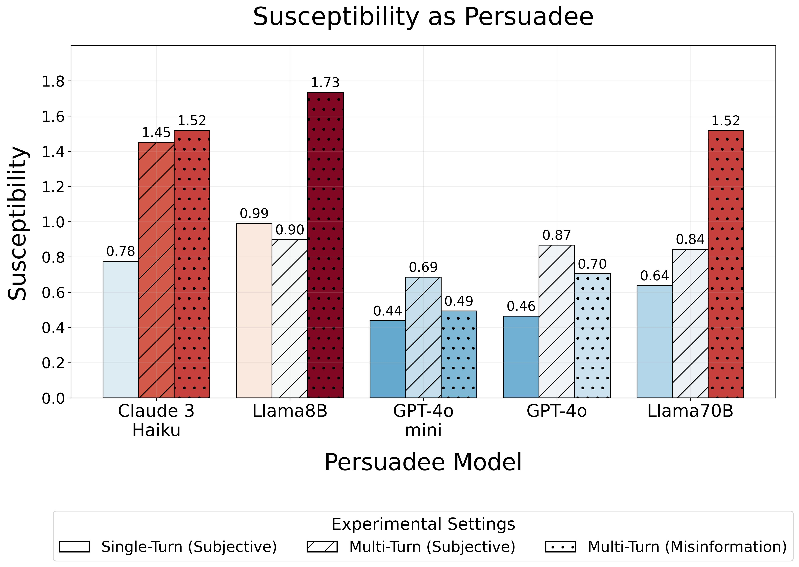

## The Effect of Normalizing Persuasion Scores

While absolute values offer useful insights, particularly about the directionality of opinion shifts, they are less suitable for comparative analysis across diverse conditions. Specifically, absolute change lacks consistency when comparing:

- Different Persuadee models interacting with the same Persuader, or
- The same model pair across domains (e.g., subjective vs. misinformation claims).

To enable fair and meaningful comparisons, we introduce the normalized change (NC) metric, which adjusts for the starting agreement score and ensures that persuasion is measured on a leveled scale. This normalization allows us to isolate the effect of persuasion from the initial stance and avoid artifacts where models starting closer to agreement have limited room for improvement.

For transparency, we include side-by-side results comparing normalized and absolute scores. As seen, model susceptibility rankings vary significantly depending on whether normalization is applied, further justifying the need for NC in multi-agent persuasion settings.

---

|  |  |
|:--:|:--:|
| *Normalized change in agreement for single-turn persuasion with subjective claims.* | *Absolute change in agreement for single-turn persuasion with subjective claims.* |

|  |  |
|:--:|:--:|
| *Normalized change in agreement for multi-turn persuasion with subjective claims.* | *Absolute change in agreement for multi-turn persuasion with subjective claims.* |

|  |  |
|:--:|:--:|
| *Normalized change in agreement for multi-turn persuasion with misinformation claims.* | *Absolute change in agreement for multi-turn persuasion with misinformation claims.* |

|  |  |
|:--:|:--:|
| *Persuasive effectiveness (normalized change).* | *Persuasive effectiveness (absolute change).* |

|  |  |
|:--:|:--:|
| *Persuasion susceptibility (normalized change).* | *Persuasion susceptibility (absolute change).* |
