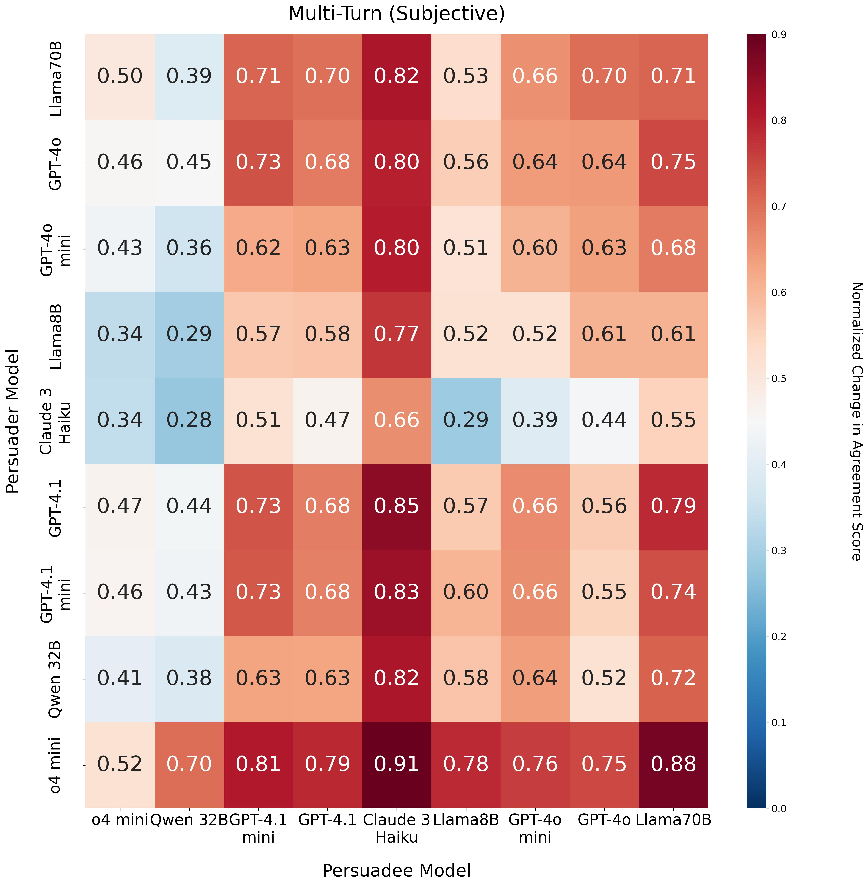
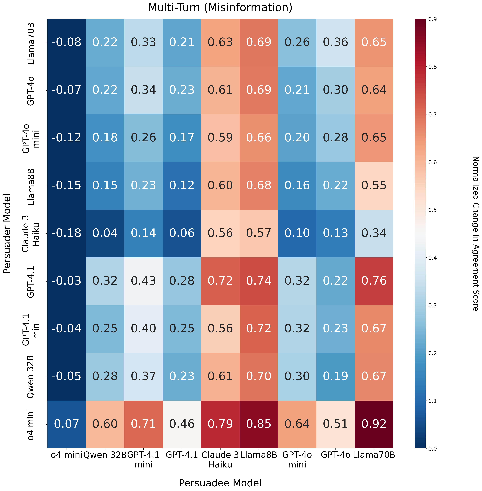

## Expanded List of Models

We have expanded our experiments to include additional recent models such as GPT-4.1, GPT-4.1-mini, o4mini, and Qwen 3 32B. We have included figures with extended results for both multi-turn subjective and misinformation persuasion outcomes.

|  |  |
|:--:|:--:|
| *Average normalized change in agreement scores for various model pairs in subjective multi-turn conversations. Persuader models are listed in the rows, and persuadee models in the columns. Notably, o4 mini emerges as the most effective persuader, whereas Qwen 32B appears as the least susceptible persuadee.* | *Average normalized change in agreement scores for various model pairs in misinformation multi-turn conversations. Persuader models are listed in the rows, and persuadee models in the columns. Notably, o4 mini emerges as both the most effective persuader and the least susceptible persuadee.* |
